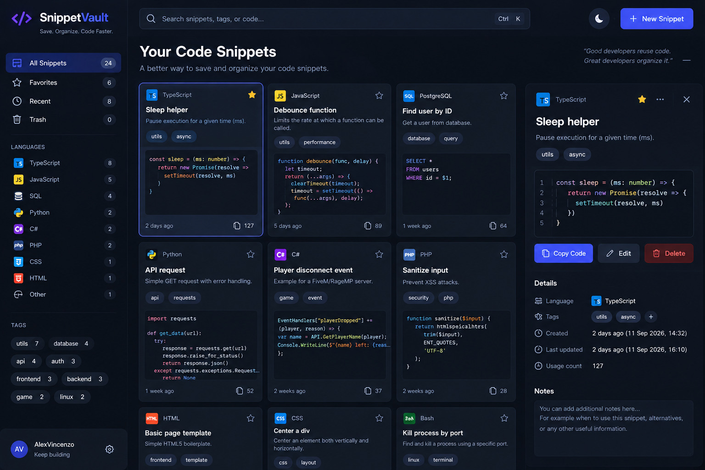

# SnippetVault

A developer-focused code snippet manager built with React, TypeScript, Vite, Tailwind CSS and a small Express API.



## Features

- Create, edit and delete code snippets
- Search by title, description, tags or code
- Filter by language
- Favorites and recent views
- Syntax highlighting
- Copy-to-clipboard with usage counter
- Persistent backend storage in `server/data/snippets.json`
- Responsive dark dashboard inspired by the included reference design

## Stack

### Frontend
- React
- TypeScript
- Vite
- Tailwind CSS v4
- Lucide React
- react-syntax-highlighter

### Backend
- Node.js
- TypeScript
- Express
- JSON file persistence for a zero-setup demo

## Run locally

```bash
npm install
npm run dev
```

Frontend: `http://localhost:5173`  
API: `http://localhost:3001`

## Production build

```bash
npm run build
```

## Project structure

```text
snippetvault/
├── client/
│   └── src/
│       ├── components/
│       ├── hooks/
│       ├── services/
│       └── types/
├── server/
│   ├── data/
│   └── src/
└── docs/
```

The backend is intentionally lightweight so the project is easy to run. You can later replace the JSON persistence with PostgreSQL/Prisma without changing the frontend API shape much.
